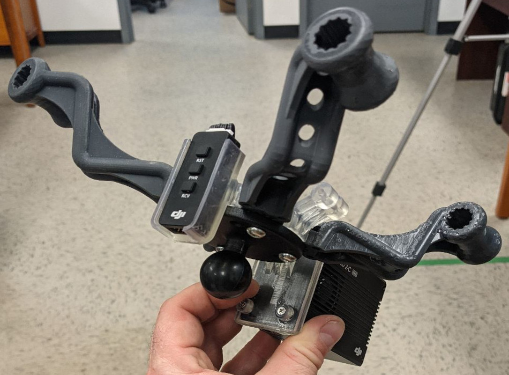
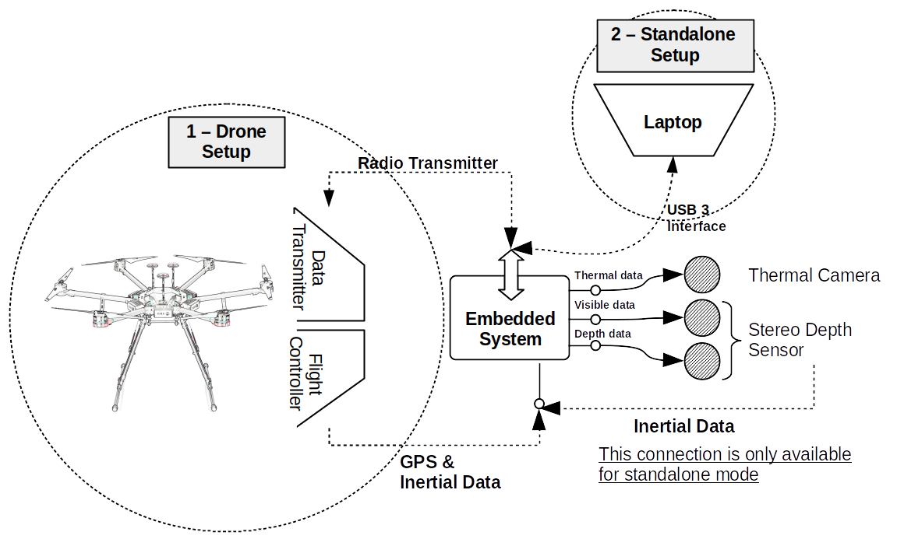
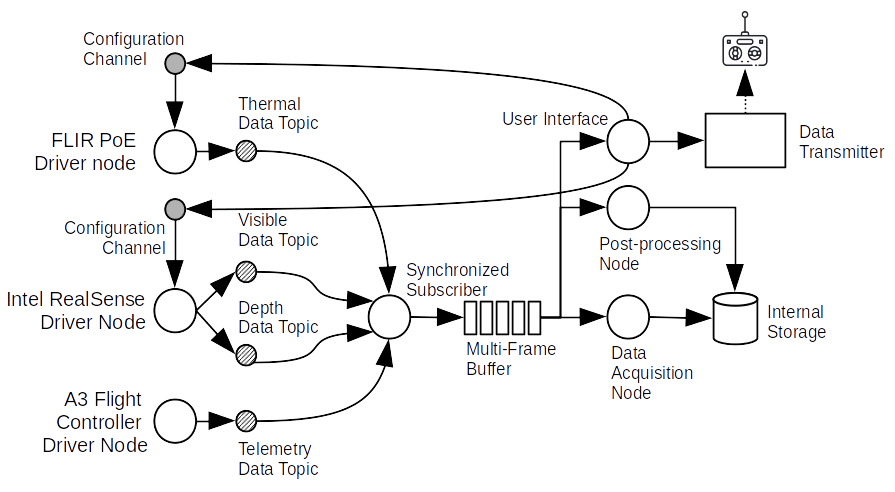
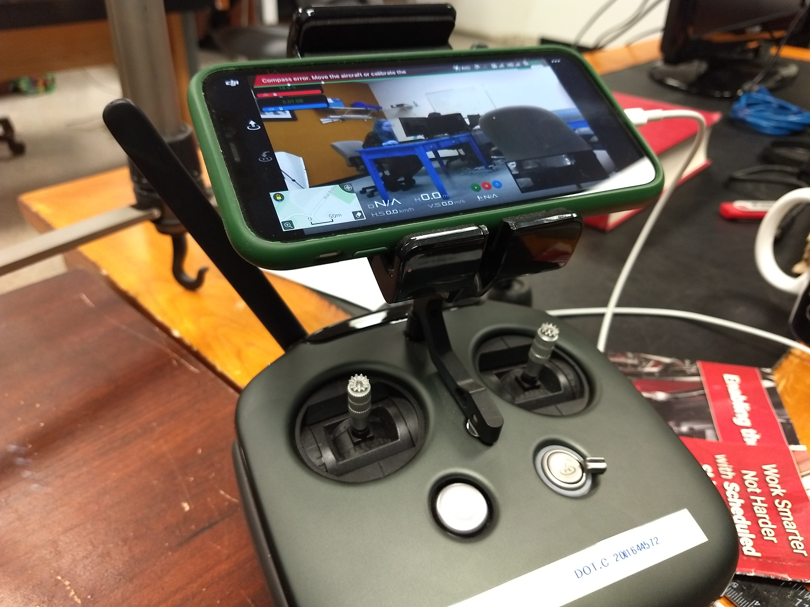

<!-- PROJECT LOGO -->
<br />
<p align="center">
  <a href="https://www.ulaval.ca/en/" target="_blank">
    
  </a>

  <h3 align="center">LeManchot-DC</h3>

  <p align="center">
	Drone-enabled Multi-modal system for inspection of industrial components
    <br/>
    <br/>
  </p>
</p>

# LeManchot-DC
In the rise of recent advancements in unmanned aerial vehicles, many studies have focused on using multi-modal platforms for remote inspection of industrial and construction sites. The acquisition of multiple data modalities assists the inspectors in acquiring comprehensive information about the surrounding environment and the targeted components. Despite the benefits of multi-modal platforms, the calibration and fusion of the obtained data modalities present many challenges that need to be addressed. One of the main problems in such systems is the dissimilarity of feature appearances in different spectrums. One of the main approaches is to employ a calibration board with geometrically known features to estimate intrinsic and extrinsic parameters and accurately align the images in thermal and visible spectral bands. This study presents a comprehensive platform for drone-based multi-modal inspection of industrial and construction components, including three main components: (a) a sensor setup that can be used as a standalone system or a payload for a drone; (b) a multi-modal embedded system and (c) a novel calibration board for multi-modal data fusion. The multi-modal embedded system provides the required features to record, transmit, and visualize the thermal, visible, and depth data synchronously. Additionally, the system presents a multi-modal fusion technique to form RGBD&T data containing thermal and texture information of the obtained 3D view. Moreover, this study introduces a novel self-heating calibration board that uses Thermoelectric Peltier modules to provide an identifiable and sharp pattern in thermal and visible images. The calibration board is designed with an aim also to be used as Ground Control Point (GCP) in drone surveys.

<p align="center">
  
  
  
</p>

## Multi-Modal Platform for Inspection of Industrial Components
This study introduces a multi-modal acquisition and processing platform for inspecting industrial components using Unmanned Aerial Vehicles. The setup is designed to attach the sensors to the aerial platform and stabilize them against the drone's vibrations while operating. The platform includes thermal, visible, and stereo depth cameras and communicates directly with the flight controller to obtain the drone's inertial and GPS data. Also, embedded software is developed for calibration, acquisition, transmission, and fusion of multi-modal data. The data fusion method presented in this study generates RGBD&T data frames that contain the thermal, visible, and depth information of the observed scene and the drone's telemetry data. Later, the RGBD&T data is projected to the system coordinate to form a point cloud of the observed scene.

<p align="center">
  
  
</p>

## Demo
<p align="center">
  
</p>

<a href="https://youtu.be/J80_gY7oOSI" target="_blank">
Video #1 - Standalone mode
</a>
<br/>
<a href="https://youtu.be/Hobju6ha29c" target="_blank">
Video #2 - Drone mode
</a>

## Requirement
* Docker
* ROS Melodic
* OpenCV
* rospy
* pillow
* imageio
* console-menu
* kivy
* kivymd
* imutils
* flask
* psutil

## How To Run
For running the system, two scripts are prepared to automate the execution:

```
git clone https://github.com/parham/lemanchot-dc
cd lemanchot-dc
chmod u+x lemanchot_run.sh
chmod u+x run_docker.sh
./lemanchot_run.sh -a
./run_docker.sh
```

## Team
**Parham Nooralishahi** is a specialist in embedded and intelligent vision systems and currently is a Ph.D. student at Universite Laval working on developing drone-enabled techniques for the inspection of large and complex industrial components using multi-modal data processing. He is a researcher with a demonstrated history of working in the telecommunication industry and industrial inspection and in-depth expertise in robotics & drones, embedded systems, advanced computer vision and machine learning techniques. He has a Master’s degree in Computer Science (Artificial Intelligence). During his bachelor's degree, he was involved in designing and developing the controlling and monitoring systems for fixed-wing drone for search and rescue purposes. Also, during his Master's degree, he worked extensively on machine learning and computer vision techniques for robotic and soft computing applications.

**Fernando Lopez** is a senior scientist with over 12 years of experience in industry and research in infrared (IR) imaging, advanced non-destructive testing and evaluation (NDT&E) of materials, applied heat transfer, and signal processing. After obtaining his Ph.D. in Mechanical Engineering in 2014, he worked as a Postdoctoral Researcher at Universit'e Laval, conducting research projects with various industrial partners, mainly in aerial IR thermography (IRT) inspection, energy efficiency, and robotic IRT for the NDT&E of aerospace components. He has been the recipient of several academic and research awards, including the 2015 CAPES Doctoral Thesis Award in Engineering, 2015 UFSC Honorable Mention Award, Emergent Leaders of the Americas Award from the Ministry of Foreign Affairs and International Trade of Canada and the Best Presentation Award from 7th International Workshop Advances in Signal Processing for NDE of Materials. Dr. Lopez is currently the Chair of the Program Committee of the CREATE NSERC Innovative Program on NDT and a member of the Standard Council Canada ISO/TC 135/SC 8 on Thermographic Testing. His scientific contributions include more than 20 publications in peer-reviewed journals and international conferences. He is currently Director of Research and Development at TORNGATS, leading several R&D initiatives on advanced NDT&E methods.

**Xavier P.V. Maldague** received the B.Sc., M.Sc., and Ph.D. degrees in electrical engineering from Universite Laval, Quebec City, Canada, in 1982, 1984, and 1989, respectively. He has been a Full Professor with the Department of Electrical and Computing Engineering, Universite Laval, Quebec City, Canada, since 1989, where he was the Head of the Department from 2003 to 2008 and 2018. He has trained over 50 graduate students (M.Sc. and Ph.D.) and has more than 300 publications. His research interests include infrared thermography, nondestructive evaluation (NDE) techniques, and vision/digital systems for industrial inspection. He is an Honorary Fellow of the Indian Society of Nondestructive Testing. He is also a Fellow of the Canadian Engineering Institute, the American Society of Nondestructive Testing, and the Alexander von Humbolt Foundation, Germany. He holds the Tier 1 Canada Research Chair in Infrared Vision. He has been the Chair of the Quantitative Infrared Thermography (QIRT) Council since 2004.

## Contact
Parham Nooralishahi - parham.nooralishahi@gmail.com | [@phm](https://www.linkedin.com/in/parham-nooralishahi/) <br/>

## Acknowledgements
This research is supported by the Canada Research Chair in Multi-polar Infrared Vision (MiViM), the Natural Sciences, and Engineering Research Council (NSERC) of Canada through a discovery grant and by the "oN Duty!" NSERC Collaborative Research and Training Experience (CREATE) Program. Special thanks to TORNGATS company for their support in testing and manufacturing of the parts.

